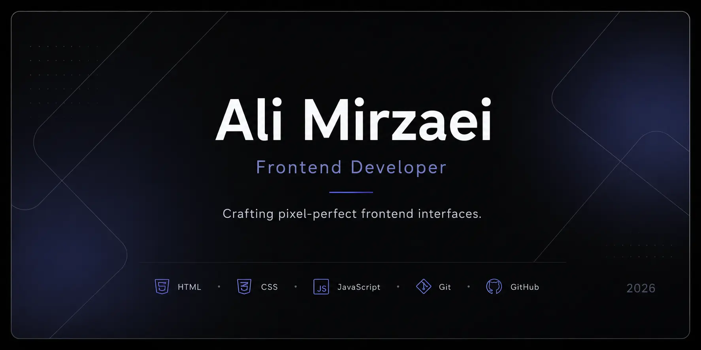
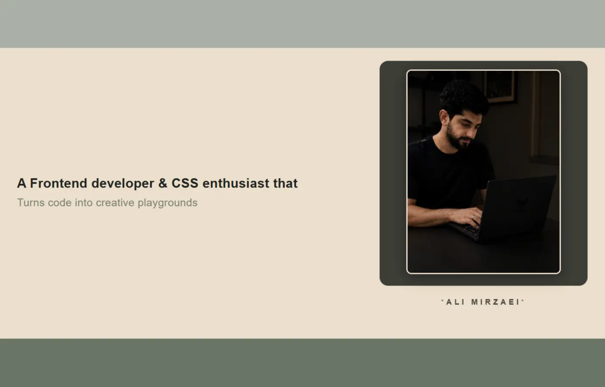
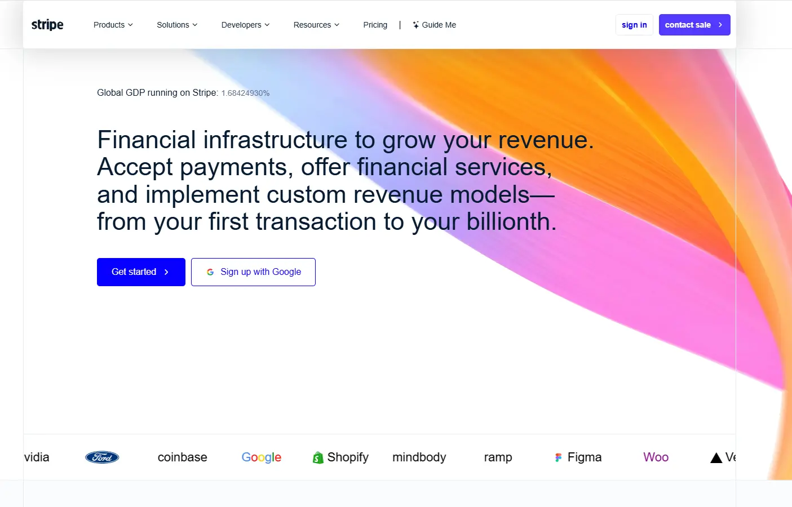
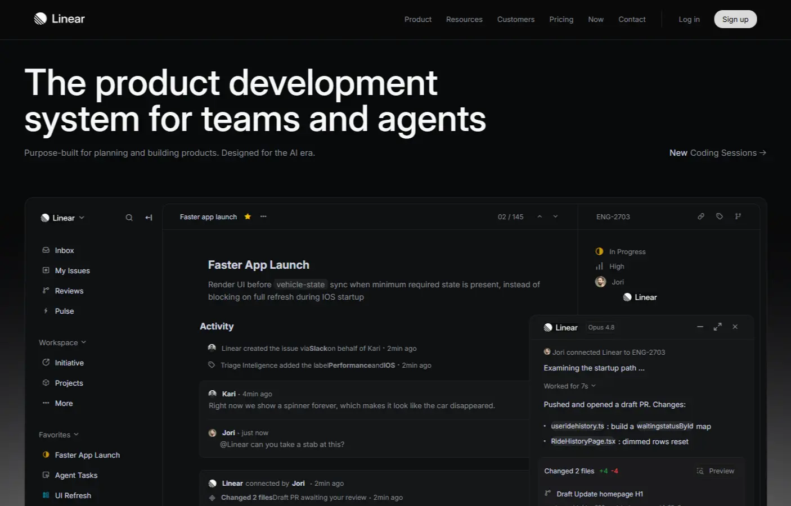
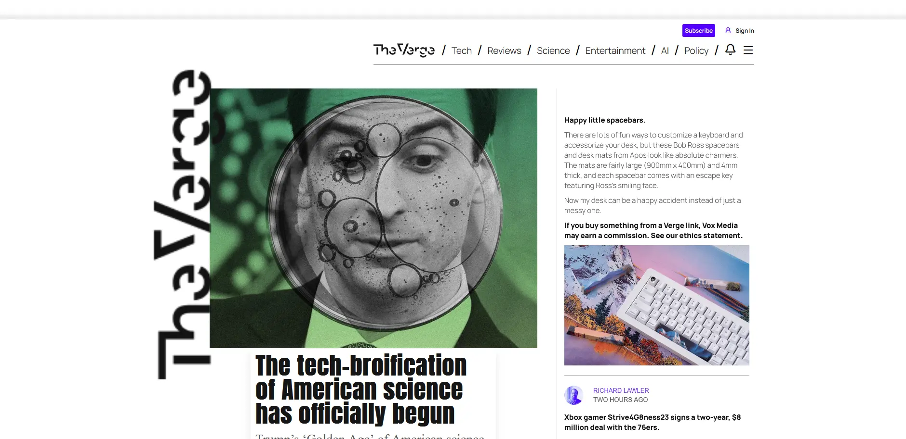

 

 

<table>
<tr>

<td valign="top" width="60%">

## Introduction

I'm a frontend developer focused on building clean, modern, and pixel-perfect user interfaces. I enjoy recreating real-world products to sharpen my design eye and frontend skills, with a strong emphasis on thoughtful details, smooth interactions, and high-quality user experiences.

</td>

<td valign="top" width="40%">

## Current Focus

- ✓ HTML & CSS
- ◉ Learning JavaScript
- ○ React
- ○ Modern UI Design

</td>

</tr>
</table>

## Featured Projects

<table>
<tr>

<td width="50%" valign="top" align="center">

### CSS Playground

Creative CSS experiments, animations, and UI components.

<a href="https://ali-mirzaei-dev.github.io/CSS-Playground/">View Demo </a> •
<a href="https://github.com/ali-mirzaei-dev/CSS-Playground">Repository</a>

</td>

<td width="50%" valign="top" align="center">

### Stripe Website

Pixel-perfect recreation of Stripe's landing page.

<a href="https://ali-mirzaei-dev.github.io/Stripe-Website/">View Demo </a> •
<a href="https://github.com/ali-mirzaei-dev/Stripe-Website">Repository</a>

</td>

</tr>

<tr>

<td width="50%" valign="top" align="center">

### Linear Website

Faithful recreation of Linear's clean interface.

<a href="https://ali-mirzaei-dev.github.io/Linear-Website/">View Demo </a> •
<a href="https://github.com/ali-mirzaei-dev/Linear-Website">Repository</a>

</td>

<td width="50%" valign="top" align="center">

### The Verge Clone

Editorial website inspired by The Verge.

<a href="https://ali-mirzaei-dev.github.io/The-Verge-Website/">View Demo</a> •
<a href="https://github.com/ali-mirzaei-dev/The-Verge-Website">Repository</a>
</td>

</tr>

</table>

## Tech Stack

## GitHub Activity

## Connect

