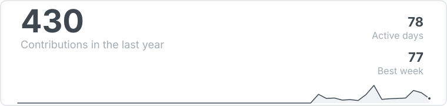
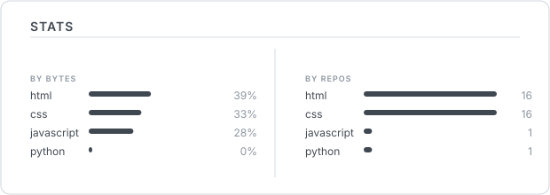

<!-- ==================== ASCII PORTRAIT ==================== -->

  

<!-- ==================== STATS ==================== -->

  

  

  

<!-- ==================== ABOUT + TECH + CONNECT ==================== -->

<table style="border: none; border-collapse: collapse;">
<tr style="border: none;">

<td valign="top" width="60%" style="border: none; padding-right: 40px;">

## About Me

I'm a frontend developer focused on building clean, modern, and pixel-perfect user interfaces. I enjoy recreating real-world products to sharpen my design eye and frontend skills, with a strong emphasis on thoughtful details, smooth interactions, and high-quality user experiences.

</td>

<td valign="top" width="40%" style="border: none;">

## Current Focus

- ✓ HTML & CSS
- ◉ Learning Responsive Design
- ○ Learning JavaScript
- ○ React
- ○ Modern UI Design

</td>

</tr>
</table>

<!-- ==================== STACK ==================== -->

  

HTML · CSS · JavaScript · Git · GitHub · VS Code

  

